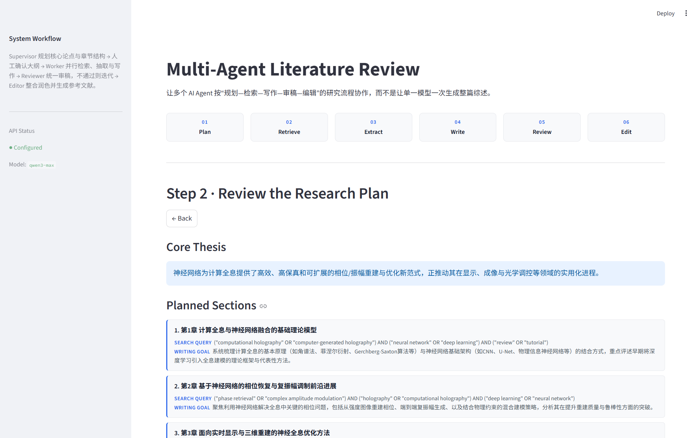
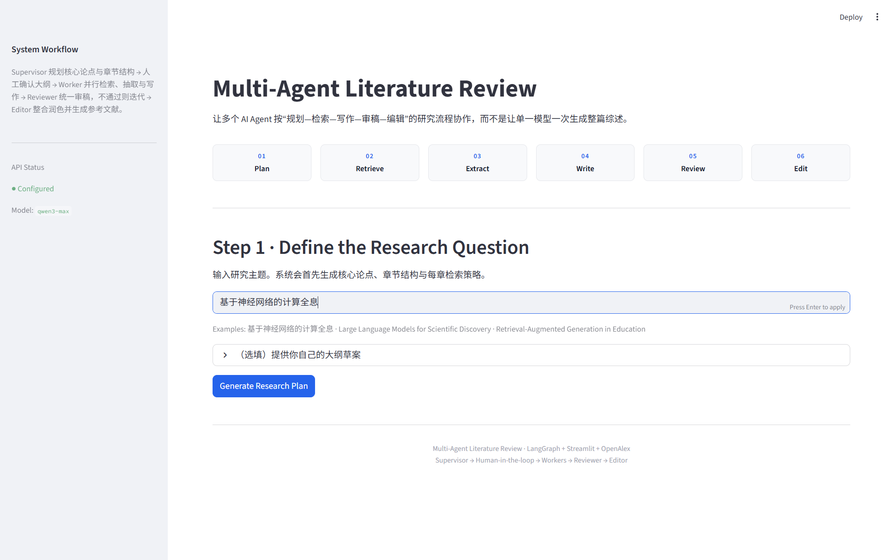
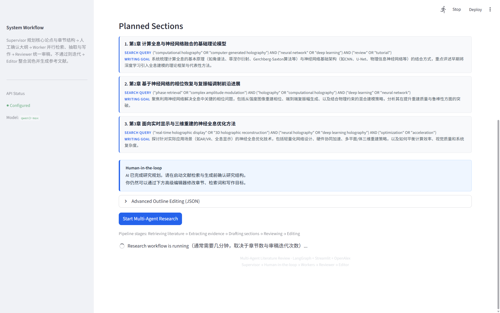
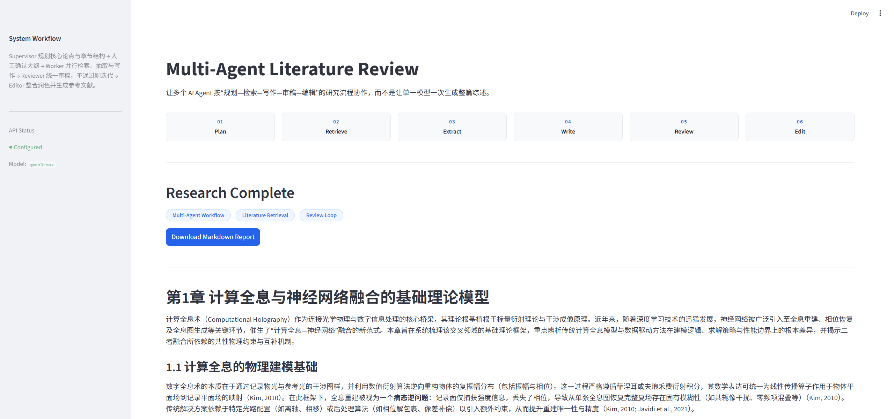
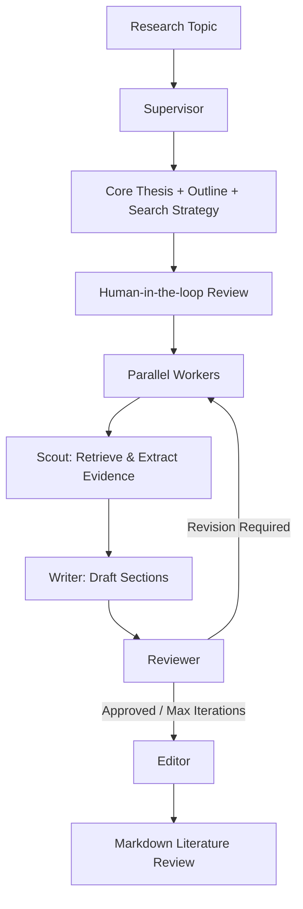

# Multi-Agent Literature Review

> 一个将“学术综述生成”拆解为规划、检索、事实抽取、写作、审稿与编辑的多智能体研究工作流。

**The goal is not to make one LLM write longer, but to make AI research more controllable, evidence-grounded and reviewable.**



## Why

单一 LLM 直接承担长篇学术综述时，经常面临：

- 引用与事实幻觉风险
- 长文结构容易失控
- 研究过程成为黑箱
- 用户只能在最终结果生成后发现方向错误
- 模型写作容易过度依赖自身参数记忆，而非真实文献证据

> **与其继续优化“一次生成”，不如重新设计 AI 完成研究任务的工作流。**

这个项目把综述任务拆成 **Plan → Retrieve → Extract → Write → Review → Edit**，让人在关键节点可以介入，同时把写作建立在真实文献检索和结构化信息抽取之上。

## Product Experience

以下截图来自一次真实完整运行（研究主题：基于神经网络的计算全息）。

### 1. Define the Research Question



用户首先定义研究问题，而不是直接要求模型生成全文。Supervisor 根据主题生成 Core Thesis、Section Outline、Search Query 与 Writing Goal。

### 2. Review Before Generation


AI 先生成完整研究规划，再由用户确认研究结构。

**在低成本规划阶段暴露错误，比整篇报告生成以后再返工更合理。**

### 3. Human-in-the-loop



Human-in-the-loop 不是系统失败后的补救措施，而是正常工作流的一部分。用户可以在启动检索、生成等高成本任务前修改章节结构、Search Query 与 Writing Goal，随后才启动 Multi-Agent Research。

### 4. Research Complete



系统完成检索、结构化抽取、章节写作、审稿与最终编辑，输出带真实参考文献的 Markdown 学术综述。当前实测流程已完整跑通。

## How It Works



| Component | Responsibility |
| --- | --- |
| Supervisor | 规划核心论点、大纲、检索策略 |
| Scout | OpenAlex 检索、相关性过滤、结构化信息抽取 |
| Writer | 根据文献证据完成章节生成 |
| Reviewer | 检查事实支撑、引用、综合分析质量 |
| Editor | 合并章节、语言统一、生成参考文献 |

Agent 的划分对应研究工作流中的不同职责和决策节点，而不是“Agent 越多越高级”。

## Product Decisions

### 1. Plan before generation

先确认研究结构，再进入高成本的检索和生成阶段。规划阶段便宜且快速，错误在此时被拦下的代价最低——这是 Human-in-the-loop 被放在执行之前的原因。

### 2. Retrieval-grounded writing

Scout 先从 OpenAlex 获取真实论文，再从摘要和元数据中结构化提取 Research Purpose、Method / Model / Dataset、Findings 与 Limitations，Writer 基于这些信息完成生成。以此为写作**增加事实约束、降低幻觉风险**，而非单纯依赖模型参数记忆。

### 3. Review as a workflow

Reviewer 是 LangGraph 的正式流程节点，未通过审核时带着修改意见进入新的迭代，而不是在最后额外加一句 `Please review the answer.`

## Tech Stack

| 层 | 技术 |
| --- | --- |
| UI | Streamlit |
| Orchestration | LangGraph StateGraph / Send |
| Agents | Supervisor / Scout / Writer / Reviewer / Editor |
| Retrieval | OpenAlex |
| LLM | OpenAI-compatible Chat Completions API |
| Concurrency | asyncio |
| State | TypedDict / Pydantic |
| Output | Markdown |

> `requirements.txt` 中仍保留 FastAPI、Redis、Milvus 等早期脚手架依赖，当前主流程未使用；只运行本项目时无需关注。

## Quick Start

环境要求：Python 3.10+

```bash
git clone https://github.com/OnePlus-X-code/literature_review.git
cd literature_review

python -m venv .venv
```

Windows:

```bash
.venv\Scripts\activate
```

macOS / Linux:

```bash
source .venv/bin/activate
```

安装依赖：

```bash
pip install -r requirements.txt
```

在项目根目录创建 `.env`：

```env
DASHSCOPE_API_KEY=your_api_key
DASHSCOPE_BASE_URL=https://dashscope.aliyuncs.com/compatible-mode/v1
OPENAI_MODEL=qwen-max
```

运行 Web Demo：

```bash
streamlit run app.py
```

或使用 CLI 入口（在 `research_plan.txt` 中填入课题后）：

```bash
python main.py
```

## Current Limitations

- 当前 Streamlit UI 尚未接入 LangGraph event streaming，执行页面不是 Agent 实时 telemetry。
- Reviewer 未通过后，目前会重新执行章节流程，而不是只针对失败段落进行精确局部修订。
- 当前事实约束主要来自论文摘要和元数据，不是全文级文献事实验证。
- 当前是产品 / 研究原型，没有用户系统、数据库以及完整生产环境能力。

## Repository Structure

```
├── app.py                    # Streamlit Demo UI（交互层：规划确认 + 执行 + 报告展示）
├── main.py                   # CLI 入口（读取 research_plan.txt，终端内人工确认大纲）
├── research_plan.txt         # CLI 配置：研究课题 + 可选大纲草案
├── literature_review/        # 核心包
│   ├── graph.py              # LangGraph 工作流（交互图 + 无头执行图）
│   ├── state.py              # ResearchState（TypedDict）与实体模型（Pydantic）
│   ├── agents/               # supervisor / scout / writer / reviewer / editor
│   └── tools/                # OpenAlex 检索客户端
├── docs/assets/              # 本文档中的真实运行截图
└── requirements.txt
```

## Author

**Chen Yijia**

GitHub: `https://github.com/OnePlus-X-code`
